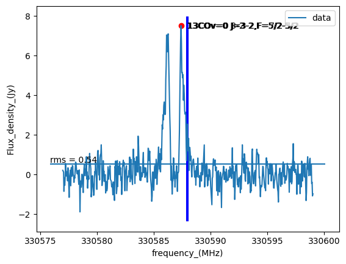
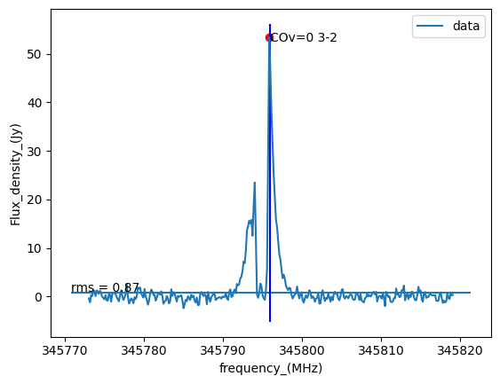

# LPD
Lines in Protoplanetary Disks. ALMA Archive High Level Data Products.

**URL**: [akdiaz.xyz/memoir](akdiaz.xyz/memoir)

## Molecular EMissiOn IdentifieR (MEMOIR)
`MEMOIR` detects the lines present in a spectrum and identifies them by comparing their frequencies against those of *known-lines*.
Needs a spectrum file (formated like the ones generated by [CASA](https://casa.nrao.edu/)) and a csv file with the *known-lines* (formated like those generated by [Splatalogue](https://splatalogue.online//). `MEMOIR` uses by default a list generated using these [commands](https://github.com/aida-ahmadi/freqcomb/blob/master/examples/lines_in_PPDs.py) of [`FreqComb`](https://github.com/aida-ahmadi/freqcomb). See examples below.


### Installation

```bash
❯ pip install memoir-lpd
```

### Usage

In the directory where your spectra files are stored, run:

```
❯ memoir
```

This will produce a text file (called "detected-lines.txt") with the identified lines and their peak properties (velocity, frecuency and flux/intensity), and a plot (a .png file with the same name of the input spectrum file) with useful information, both inside a subfolder named "output" by default. If you pass several spectra to the script, you will get one plot per spectrum but only one file with the information of all the lines detected. The *name* of the lines includes a reference to the spectrum on which they were found.

For example, if you analyse the spectra in the input files "spw_0.txt" and "spw_3.txt" (containing one CO line each), you will get an output text file (named "detected-lines.txt") like this:

```
# Spectrum_Peak_ID	Species	Transition	Teorical_Frequency	Redshifted_Frequency	Peak_frequency_(MHz)	Peak_Velocity_(km/s)	Peak_Flux_density_(Jy)
spw0_0 13COv=0 J=3-2,F=5/2-5/2 330587.867100 330587.867100 330587.387762 0.528000 7.513535
spw0_0 13COv=0 J=3-2,F=5/2-3/2 330587.949000 330587.949000 330587.387762 0.528000 7.513535
spw0_0 13COv=0 3-2 330587.965300 330587.965300 330587.387762 0.528000 7.513535
spw0_0 13COv=0 J=3-2,F=7/2-5/2 330587.981600 330587.981600 330587.387762 0.528000 7.513535
spw3_0 COv=0 3-2 345795.989900 345795.989900 345795.840051 0.130000 53.377550
```
and two plots like these (named "spw_0.png" and "spw_3.png"):





In this case, `MEMOIR` found one line (spw0_0) that could be any of the 13COv=0 listed, and another one (spw3_0) that could be COv=0 3-2, whose peaks are marked in the plot as red dots, and the frequency of the posible lines are marked with blue lines.

There are several options you can set to control the behavior of `MEMOIR`. You can view a list of them with

```
❯ memoir -h
```
which produces

```
optional arguments:
  -h, --help            show this help message and exit
  -i FITS_IMAGE [FITS_IMAGE ...], --fits_image FITS_IMAGE [FITS_IMAGE ...]
                        Fits image to take spectrum on mask <<fits_mask>>.
                        (default: [''])
  -m FITS_MASK [FITS_MASK ...], --fits_mask FITS_MASK [FITS_MASK ...]
                        Mask used to take spectrum in image <<fits_image>>.
                        (default: [''])
  -t FREQUENCY_TOLERANCE, --frequency_tolerance FREQUENCY_TOLERANCE
                        Frequency tolerance (in the frequency units of the
                        input spectrum). If a detected line has a known line
                        with a frequency separation less than
                        <<frequency_tolerance>>, it will assume its ID, if
                        not, will remain unidentified (U). (default: 2)
  -w LINE_WIDTH, --line_width LINE_WIDTH
                        Line width (in the velocity units of the input
                        spectrum). Local peaks closer than <<line_width>> will
                        be considered as belonging to the same line, and only
                        the one with higher flux will be returned. (default:
                        20)
  --snr SNR             Signal-to-noise ratio. Only peaks with flux higher
                        than <<SNR>> will be returned (default: 5)
  -s SPECTRUM_FILE_NAME [SPECTRUM_FILE_NAME ...], --spectrum_file_name SPECTRUM_FILE_NAME [SPECTRUM_FILE_NAME ...]
                        Name of the file (including extension) with the
                        spectrum to analyse. If not set (default behaviour)
                        will use all the files in the working directory end-
                        named 'spectrum.txt'. (default: [''])
  -l KNOWN_LINES_FILE_NAME, --known_lines_file_name KNOWN_LINES_FILE_NAME
                        Name of the file (including extension) with the known
                        lines. (default: allmols_combined_transitions.csv)
  -o OUTPUT, --output OUTPUT
                        Name of the output folder. (default: output)
  --vlsr VLSR           Source radial velocity (local standard of rest) in
                        km/s. (default: 0)
```

## How it works:
0. If necessary, extract a spectrum from a fits image (provided by --i) using a mask image (provided by -m). Some details:
   - if the mask is all blank, skips to the next image and mask provided.
   - the mask can have different masking in each channel, so `MEMOIR` constructs a new one-channel-mask that is the union the masks in all channels and uses it to take the spectrum.
   - the spectrum extracted with the one-channel-mask is written to disk and used as input in the next step.
1. Finds the lines in the spectrum whose peaks are above a certain threshold (provided by --snr) and that are separated in velocity more than certain value (provided by -w). These are the *detected lines*.
2. Looks up in the csv file containing the *known-lines* and
   - redshifts the teorethical frequencies according the velocity of the source (provided by --vlsr).
   - finds those lines that have redshifted frequencies inside the frequency range of your spectrum. These are the *expected lines*.
3. Matches each *detected line*, with **all** the *expected lines* that are closer in frequency than certain value (provided by -t).
4. Returns the output files (see above).

## Examples:

**Runing for multiple spectrum files:**
```
❯ memoir -s spw0.txt spw3.txt
```
will run `MEMOIR` in the files "spw0.txt" and "spw3.txt" in your current folder.

```
❯ memoir -s *.txt
```
will run `MEMOIR` in all the .txt files in your current folder.

```
❯ memoir
```
will run `MEMOIR` in all the files end-named "spectrum.txt" in your current folder.

**Taking spectrum as first step:**
```
❯ memoir -i cube.fits -m mask.fits
```
will make `MEMOIR` take a spectrum in "cube.fits" using the mask "mask.fits". The spectrum will be written to disk in a file named "cube.spectrum.txt" in your current folder. After the spectrum file is created, the analysis continues automatically.

```
❯ memoir -i cube1.fits cube2.fits  -m mask1.fits mask2.fits
```
will make `MEMOIR` take a spectrum in "cube1.fits" using the mask "mask1.fits", and in "cube2.fits" using the mask "mask2.fits". The spectra will be written to disk in two files named "cube1.spectrum.txt" and "cube2.spectrum.txt" in your current folder. You can use as many cubes and corresponding masks as desired.


**Example of input spectrum file**:
```
# spw0.image, region=
# beam size: 17.262405172558292 arcsec2, 53.13144097434767 pixels
# Total flux: 7.47938294096 Jy.MHz
# Channel number_of_unmasked_pixels frequency_(MHz) Velocity_(km/s) Flux_density_(Jy)
        0                       269   330598.997228       -9.999833     -9.647420e-01
        1                       269   330598.961941       -9.967834     -1.071281e+00
        2                       269   330598.926653       -9.935835     -3.810407e-01
        3                       269   330598.891366       -9.903836     -4.499658e-01
        4                       269   330598.856079       -9.871837      5.284649e-01
        5                       269   330598.820792       -9.839839      4.755686e-01
```

**Example of input known-lines file**:
```
Species,ChemicalName,QNs,Freq,log10_Aij,EU_K,CDMS/JPL Intensity
CNv=0,Cyanide Radical,"N=1-0,J=1/2-1/2,F=1/2-1/2",113.1233687,-5.89067,5.43004,-4.7119
CNv=0,Cyanide Radical,"N=1-0,J=1/2-1/2,F=1/2-3/2",113.14419,-4.9776,5.43003,-3.7989
CNv=0,Cyanide Radical,"N=1-0,J=1/2-1/2,F=3/2-1/2",113.170535,-5.28862,5.43231,-3.809
CNv=0,Cyanide Radical,"N=1-0,J=1/2-1/2,F=3/2-3/2",113.191325,-5.17514,5.4323,-3.6956
CNv=0,Cyanide Radical,"N=1-0,J=3/2-1/2,F=5/2-3/2",113.490985,-4.92358,5.44668,-3.2691
CNv=0,Cyanide Radical,"N=1-0,J=3/2-1/2,F=1/2-1/2",113.499643,-4.97352,5.4481,-3.7962
CNv=0,Cyanide Radical,"N=1-0,J=3/2-1/2,F=3/2-3/2",113.508934,-5.28472,5.44754,-3.8064
CNv=0,Cyanide Radical,"N=1-0,J=3/2-1/2,F=1/2-3/2",113.5204215,-5.88634,5.44809,-4.7091
CNv=0,Cyanide Radical,"N=2-1,J=3/2-3/2,F=1/2-1/2",226.2874265,-4.98737,16.30806,-4.1215
CNv=0,Cyanide Radical,"N=2-1,J=3/2-3/2,F=3/2-1/2",226.3030784,-5.37977,16.30881,-4.2129
CNv=0,Cyanide Radical,"N=2-1,J=3/2-3/2,F=3/2-3/2",226.31454,-5.00405,16.30893,-3.8372
CNv=0,Cyanide Radical,"N=2-1,J=3/2-3/2,F=3/2-5/2",226.3325364,-5.34151,16.30893,-4.1747
CNv=0,Cyanide Radical,"N=2-1,J=3/2-3/2,F=5/2-3/2",226.3419306,-5.50078,16.31025,-4.1579
CNv=0,Cyanide Radical,"N=2-1,J=3/2-3/2,F=5/2-5/2",226.359871,-4.79365,16.31024,-3.4508
CNv=0,Cyanide Radical,"N=2-1,J=3/2-1/2,F=1/2-3/2",226.6165554,-4.96955,16.30818,-4.1043
CNv=0,Cyanide Radical,"N=2-1,J=3/2-1/2,F=3/2-3/2",226.63219,-4.37065,16.30893,-3.2044
CNv=0,Cyanide Radical,"N=2-1,J=3/2-1/2,F=5/2-3/2",226.659575,-4.02379,16.31024,-2.6815
CNv=0,Cyanide Radical,"N=2-1,J=3/2-1/2,F=3/2-1/2",226.679382,-4.27836,16.30889,-3.1122
CNv=0,Cyanide Radical,"N=2-1,J=5/2-3/2,F=7/2-5/2",226.874745,-3.94188,16.33495,-2.4751
CNv=0,Cyanide Radical,"N=2-1,J=5/2-3/2,F=5/2-5/2",226.892119,-4.74221,16.33579,-3.4004
CNv=0,Cyanide Radical,"N=2-1,J=5/2-3/2,F=3/2-5/2",226.9053771,-5.94809,16.33642,-4.7824
```
[](https://github.com/psf/black)
